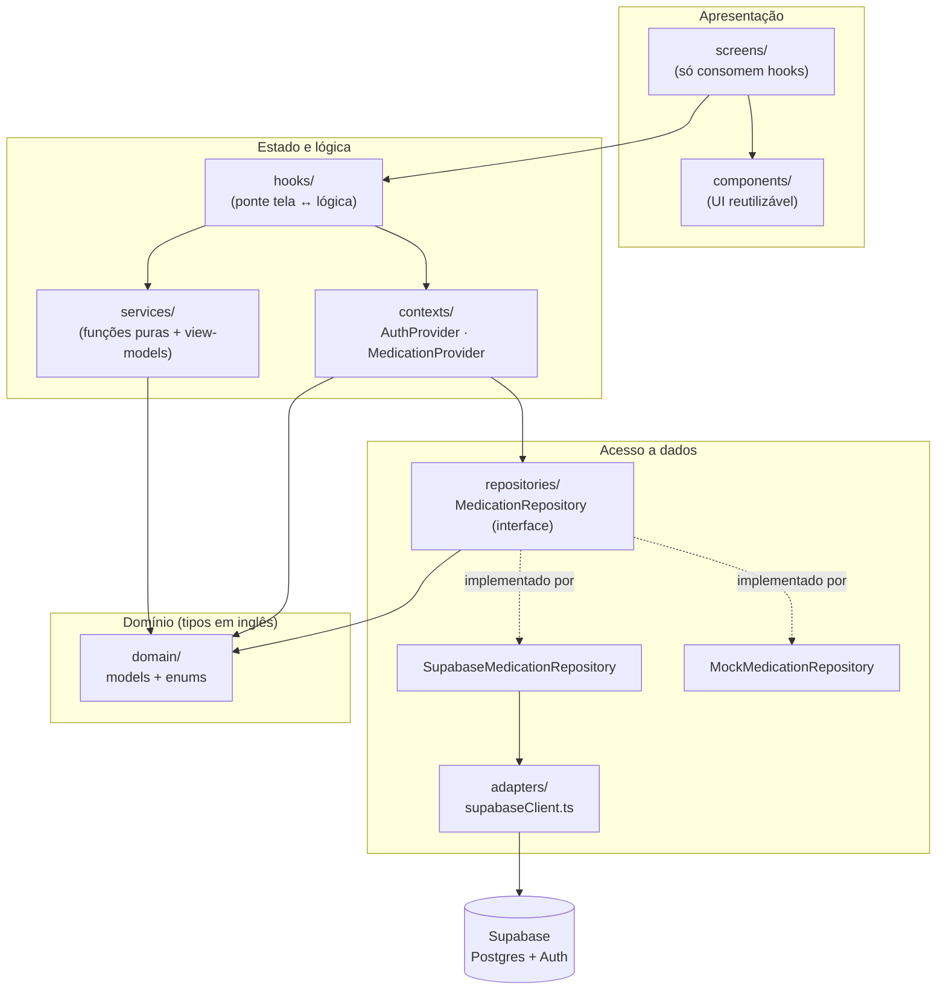
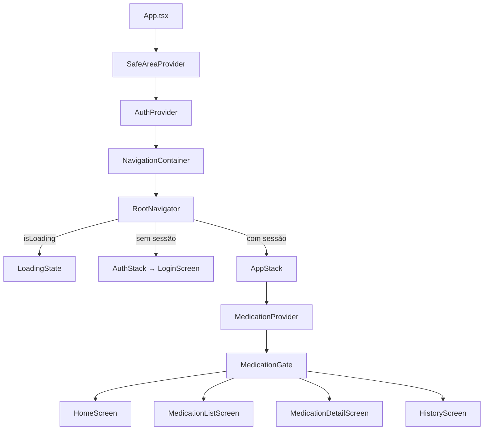
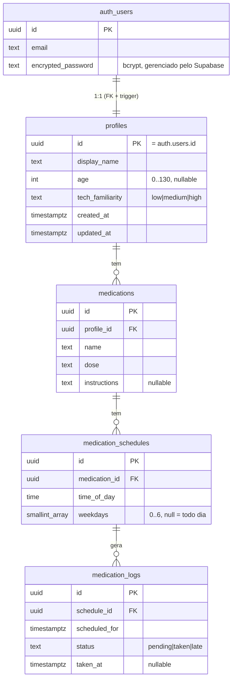
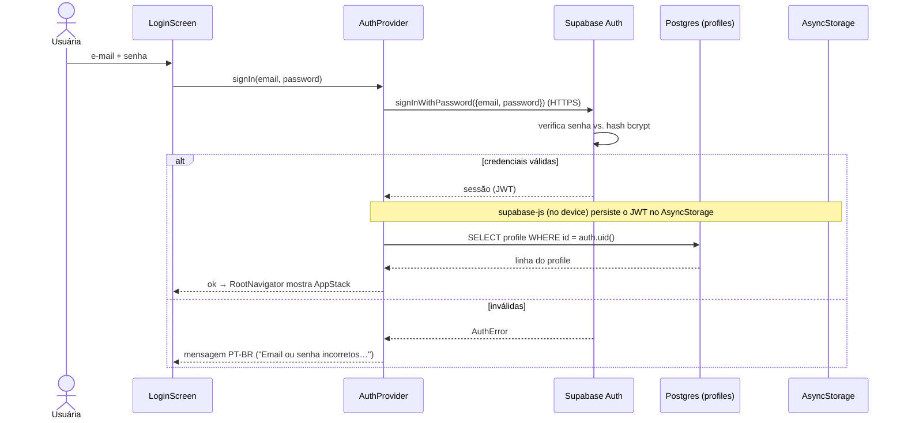
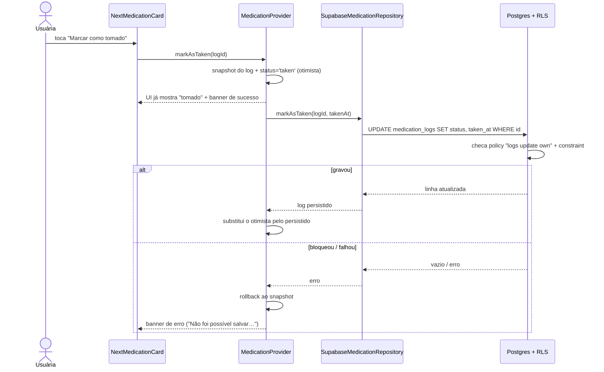

# Arquitetura do app Takere

Documento de referência para o texto do TCC. Explica **como o sistema é montado
e por quê** — a separação em camadas, como o frontend é construído, o que é o
backend e com o que ele se comunica, como as senhas são guardadas e como o app e
o banco conversam.

> Para **instalação, variáveis de ambiente e cenário demo**, veja o
> [`README.md`](../README.md) da raiz e o [`supabase/README.md`](../supabase/README.md).
> Para as **regras de import entre camadas**, veja o [`CLAUDE.md`](../CLAUDE.md).
> Este documento complementa esses arquivos: foca na arquitetura e nas decisões.

---

## TL;DR

- **O que é:** app mobile (Expo / React Native) de **registro pessoal** de
  medicamentos para tratamentos de média e longa duração. Artefato de TCC; **não
  é sistema clínico** — não prescreve, não valida dosagem, não usa dado real de
  saúde.
- **Frontend:** React Native 0.81 + React 19 sobre Expo SDK 54, TypeScript
  estrito, navegação por `@react-navigation/native-stack`. Estado global em dois
  React Contexts (`AuthProvider`, `MedicationProvider`); telas só consomem
  **hooks**; toda regra de derivação fica em **services puros**.
- **Backend:** **Supabase** (PostgreSQL gerenciado + Auth + API HTTP). O app não
  tem servidor próprio — fala direto com o endpoint do projeto Supabase via
  HTTPS. São **4 tabelas** (`profiles`, `medications`, `medication_schedules`,
  `medication_logs`), todas com **Row-Level Security (RLS)** isolando dados por
  usuário.
- **Senhas:** o app **nunca** vê, gera hash nem guarda senha. Quem cuida disso é
  o **Supabase Auth** — senhas ficam em `auth.users`, com **hash bcrypt no
  servidor**. O app só recebe um **JWT** de sessão, persistido localmente em
  `AsyncStorage`.
- **Conexão front ↔ back:** um único **adapter** (`supabaseClient.ts`) inicializa
  o cliente; um **Repository Pattern** desacopla as telas do banco; o JWT da
  sessão viaja em cada requisição e a RLS no Postgres filtra por `auth.uid()`.
- **Padrão de escrita:** **optimistic update** — a UI muda na hora e faz
  *rollback* se a gravação falhar.

Fluxo de dados, do toque ao banco:

```
Tela → Hook → Service (puro) → [view-model]      ← leitura/derivação
Tela → Hook → MedicationProvider → Repository → Supabase (RLS)  ← escrita
```

---

## 1. Visão geral em camadas

A arquitetura é organizada em camadas com responsabilidade única. O princípio
central: **todo I/O externo (Supabase) fica isolado em `adapters/` e
`repositories/`**; as telas são apresentação pura e os `services/` não têm efeito
colateral. Isso mantém a regra de negócio testável e independente do backend.



**Quem pode importar o quê** (regra registrada no `CLAUDE.md`):

| Camada | Importa | **Não** importa |
|---|---|---|
| `screens/` | hooks, components, theme, navigation | mocks, services, repositories, `expo-*` |
| `components/` | theme, domain | screens, hooks, mocks, `expo-*` |
| `hooks/` | services, contexts, domain | mocks, adapters, `expo-*` |
| `services/` | domain | mocks, hooks, contexts, adapters |
| `repositories/` | domain, mappers, adapter | services, contexts, hooks |
| `contexts/` | repositories, domain, adapter | screens, mocks |
| `adapters/` | `expo-*`, `supabase-js`, domain | todo o resto |

> **Por que isso importa para o TCC:** essa separação é o que permite trocar o
> backend (Supabase ↔ mock em memória) sem tocar em nenhuma tela — ver §7 e §9.
> É também o que mantém a regra de negócio (cálculo de status, histórico) em
> funções puras fáceis de raciocinar e, futuramente, testar.

---

## 2. Stack e configuração

| Item | Versão / escolha | Papel |
|---|---|---|
| Expo | SDK `~54.0.0` | Tooling, build e runtime React Native |
| React Native | `0.81.5` | Framework de UI mobile |
| React | `19.1.0` | Biblioteca base de componentes |
| TypeScript | `^5.3.3`, modo **estrito** | Tipagem estática |
| React Navigation | `native` `^7` + `native-stack` `^7.2` | Navegação por pilha nativa |
| `@supabase/supabase-js` | `^2.105.4` | Cliente do backend (auth + dados) |
| `@react-native-async-storage/async-storage` | `2.2.0` | Persistência local da sessão (JWT) |
| `date-fns` | `^4.1.0` | Datas (escolhido sobre moment) |
| `react-native-url-polyfill` | `^3.0.0` | Polyfill de `URL` exigido pelo supabase-js no RN |

Decisões registradas: **sem** bibliotecas de UI/ícones/animação/gráfico (escolha
consciente para manter o estudo de UX focado); `expo-router` descartado em favor
de React Navigation native-stack; sem dark mode na v1; sem testes automatizados
nesta fase.

**Como o Supabase é configurado.** As credenciais **não** ficam no `app.json`:
são lidas de variáveis de ambiente com o prefixo `EXPO_PUBLIC_`, que o Expo
injeta no bundle em tempo de build e expõe via `process.env`:

```
EXPO_PUBLIC_SUPABASE_URL=https://<seu-projeto>.supabase.co
EXPO_PUBLIC_SUPABASE_ANON_KEY=<anon-key-publica>
```

Isso permite manter o `.env` fora do git e trocar os valores por ambiente (dev
local vs. build EAS). Só a chave **anônima** (publishable) entra no cliente — a
`service_role` **nunca** vai para o app (ver §8). O `eas.json` define um perfil
`preview` que gera um APK Android instalável (`distribution: internal`,
`buildType: apk`) para a banca.

---

## 3. Frontend: como a interface é montada

### 3.1 Árvore de providers (`App.tsx`)

A raiz compõe três camadas de contexto, de fora para dentro:

```tsx
// App.tsx
<SafeAreaProvider>            // respeita notch / áreas do sistema
  <AuthProvider>              // sessão, usuário e profile
    <NavigationContainer>     // React Navigation
      <RootNavigator />       // decide qual pilha mostrar
    </NavigationContainer>
  </AuthProvider>
</SafeAreaProvider>
```

O `AuthProvider` envolve a navegação inteira porque **a sessão decide qual pilha
de telas existe**.

### 3.2 Roteamento por sessão

`RootNavigator` lê o contexto de auth e escolhe entre duas pilhas — não há tabs:

```tsx
const { session, isLoading } = useAuth();
if (isLoading) return <LoadingState message="Carregando…" />;
return session ? <AppStack /> : <AuthStack />;
```

- **`AuthStack`** → só a `LoginScreen` (sessão ausente).
- **`AppStack`** → as telas autenticadas: `Home`, `MedicationList`,
  `MedicationDetail` (recebe `{ logId }`), `History`.

O `AppStack` monta o **`MedicationProvider`** e, logo abaixo, o
**`MedicationGate`** — um guarda que segura as telas enquanto os dados carregam
ou mostra `ErrorState` com botão "Tentar novamente" se a carga falhar:

```tsx
<MedicationProvider>
  <MedicationGate>          {/* cobre isLoading / error / profile null */}
    <Stack.Navigator initialRouteName="Home"> … </Stack.Navigator>
  </MedicationGate>
</MedicationProvider>
```

Como o `MedicationProvider` monta dentro do `AppStack`, ele é **desmontado no
logout** — o estado de medicamentos de um usuário não vaza para o próximo.



### 3.3 Fluxo tela → hook → service

As telas **não** conhecem o backend nem fazem cálculo: pedem dados a um hook, que
busca o estado bruto no contexto e delega a derivação a um **service puro**.
Exemplo da Home:

```
HomeScreen
  └─ useTodayMedications()
       ├─ lê { logs, schedules, medications, patientId } do MedicationProvider
       └─ MedicationService.getTodayDashboard(patientId, dados)  → TodayDashboard
```

O `MedicationService` (em `src/services/`) recebe os dados como argumento e
devolve **view-models** co-localizados (`TodayDashboard`, `MedicationDetailView`,
`MonthlyHistoryView`, `WeeklyHistoryView`). Ele concentra as regras: junta
log → schedule → medication, calcula o status (`pending` / `taken` / `late`),
ordena por horário, monta os contadores e escolhe o **"próximo medicamento"**
priorizando `late` antes de `pending`. Todas as fronteiras de dia são calculadas
em **horário local do dispositivo**.

Os hooks principais: `useTodayMedications` (Home), `useMedicationList(filtro)`
(agenda filtrável), `useMedicationDetail(logId)` (detalhe + ação),
`useMedicationHistory` (resumos mensal e semanal), `useCurrentPatient` e
`useAuth`. Cada um usa `useMemo` para só recomputar a view-model quando os dados
de origem mudam.

### 3.4 Design e UX (persona Maria, 68 anos)

Os *design tokens* ficam em `src/theme/` (`colors`, `typography`, `spacing`,
`radius`). Convenções aplicadas e ligadas às heurísticas de Nielsen / SUS:

- **Tipografia grande:** corpo ≥ 18 px, títulos 24–32 px → legibilidade
  (visibilidade do estado, h1 de Nielsen).
- **Tap targets generosos:** ação primária ≥ 56 px, secundária ≥ 44 px →
  prevenção de erro.
- **Status por texto + cor, nunca só cor.** Paleta primária teal-700; status em
  pares *fundo claro / texto escuro* (amber/green/red) com contraste **AA**
  garantido (ex.: `textMuted` é slate-500, ~4.85:1 sobre branco). Atende daltônicos
  e reforça reconhecimento em vez de memorização.
- **Sem ícones e sem animações** nesta fase (decisão consciente).
- **Feedback imediato e reversível:** banners de sucesso/erro com "Desfazer",
  anunciados via `AccessibilityInfo` para leitores de tela (controle e liberdade
  do usuário; visibilidade do estado).
- **Linguagem PT-BR coloquial**, sem jargão clínico.

---

## 4. Backend (Supabase): o que é e com o que se comunica

**O app não tem backend próprio.** O "backend" é um projeto **Supabase**, que
entrega como serviço gerenciado:

- um **PostgreSQL** com os dados do app;
- um **serviço de autenticação** (Supabase Auth / GoTrue) sobre a tabela
  `auth.users`;
- uma **API HTTP** (PostgREST) que expõe as tabelas como endpoints REST, à qual o
  `supabase-js` se conecta por **HTTPS**.

Ou seja: o cliente React Native conversa **apenas** com o endpoint do projeto
(`https://<seu-projeto>.supabase.co`) — não há camada intermediária escrita por
nós. As regras de acesso vivem **dentro do banco** (RLS + constraints + triggers),
não num servidor de aplicação.

### 4.1 Modelo de dados (4 tabelas)

Fonte de verdade: [`supabase/schema.sql`](../supabase/schema.sql). Hierarquia:
um **profile** (1:1 com o usuário autenticado) tem N **medications**; cada
medication tem N **schedules** (horários); cada schedule gera N **logs** (uma
tomada por dia/horário). Todas as FKs são `on delete cascade`.



Pontos relevantes do schema:

- **`profiles.id` referencia `auth.users.id`** — o profile guarda só dados de
  persona (nome, idade, familiaridade tecnológica), nunca credenciais.
- **Constraint de invariante** em `medication_logs`
  (`medication_logs_taken_consistency`): só pode estar `taken` se `taken_at` não
  for nulo, e vice-versa. O banco recusa estados inconsistentes.
- **Índices** em `profile_id`, `medication_id`, `schedule_id` e `scheduled_for`
  para as consultas de listagem e da janela de 30 dias.
- **Trigger `set_updated_at`** mantém `updated_at` em todas as tabelas.
- **`weekdays`** existe no schema para evolução futura; a v1 modela horários como
  linhas individuais e o domínio assume frequência diária (ver §7.2).

### 4.2 Criação automática de profile

Quando um usuário é criado em `auth.users`, um trigger materializa o profile —
assim toda conta autenticada tem uma linha em `public.profiles`:

```sql
create function public.handle_new_user()
returns trigger language plpgsql
security definer set search_path = '' as $$
begin
  insert into public.profiles (id, display_name)
  values (new.id,
    coalesce(new.raw_user_meta_data ->> 'display_name',
             split_part(new.email, '@', 1)));
  return new;
end; $$;

create trigger on_auth_user_created
  after insert on auth.users
  for each row execute function public.handle_new_user();
```

O `security definer` faz a função rodar com privilégios do owner, então o INSERT
no profile **não é barrado pela RLS** (que normalmente impediria criar a linha de
outro usuário). É a forma recomendada pelo Supabase para esse padrão.

---

## 5. Autenticação e como as senhas são guardadas

> **Resposta direta:** o app **não armazena senhas**. Quem guarda é o **Supabase
> Auth**, na tabela `auth.users`, com **hash bcrypt feito no servidor**. O código
> do app nunca vê a senha em texto, nunca calcula hash e nunca a grava — ele só
> envia as credenciais para o Supabase verificar e recebe de volta um **token de
> sessão (JWT)**.

### 5.1 Inicialização do cliente (`src/adapters/supabaseClient.ts`)

Único lugar do app que importa `supabase-js`. Configura a persistência da sessão:

```ts
export const supabase = createClient(supabaseUrl, supabaseAnonKey, {
  auth: {
    storage: AsyncStorage,    // onde o JWT da sessão é guardado no device
    autoRefreshToken: true,   // renova o token antes de expirar
    persistSession: true,     // restaura a sessão ao reabrir o app
    detectSessionInUrl: false // não é fluxo OAuth web
  },
});
```

O que persiste localmente é **o token de sessão, não a senha**. `AsyncStorage` é
um armazenamento chave-valor do dispositivo; ao reabrir o app, o supabase-js lê o
token de lá e restaura a sessão (login "lembrado").

### 5.2 Login e sessão (`src/contexts/AuthProvider.tsx`)

O `signIn` apenas repassa as credenciais ao Supabase e traduz erros para PT-BR:

```ts
const { error } = await supabase.auth.signInWithPassword({ email, password });
if (error) { setAuthError(translateAuthError(error)); return { ok: false }; }
return { ok: true };
```

O `AuthProvider` faz três coisas mais:

1. **Restaura a sessão no boot** com `supabase.auth.getSession()` (lê o token do
   `AsyncStorage`), com `catch` defensivo para não travar em "Carregando…" se o
   storage estiver corrompido.
2. **Escuta mudanças** com `onAuthStateChange` (login/logout/refresh) e atualiza
   o estado `session`.
3. **Carrega o profile** de `public.profiles` sempre que a sessão muda — é esse
   `profile` (não-nulo) que libera as telas protegidas via `MedicationGate`.



> **Por que isso é seguro e bom para o TCC:** ao delegar a autenticação a um
> serviço gerenciado, o app evita o erro clássico de "hash de senha caseiro". As
> senhas trafegam só sobre HTTPS, são verificadas server-side e nunca tocam o
> código nem o armazenamento do cliente — só o JWT de sessão fica no device.

---

## 6. Conexão front ↔ back

Duas peças desacoplam as telas do banco: o **adapter** (cliente Supabase, §5.1) e
o **Repository Pattern**.

### 6.1 Repository Pattern

A interface `MedicationRepository` define o contrato de acesso a dados; o
`MedicationProvider` depende **dela**, não da implementação concreta:

```ts
export interface MedicationRepository {
  listMedications(patientId: string): Promise<Medication[]>;
  listSchedules(patientId: string): Promise<MedicationSchedule[]>;
  listLogs(patientId: string): Promise<MedicationLog[]>;
  markAsTaken(logId: string, takenAt: string): Promise<MedicationLog | null>;
  restoreLog(log: MedicationLog): Promise<MedicationLog | null>;
}
```

Duas implementações: `SupabaseMedicationRepository` (produção) e
`MockMedicationRepository` (dev/teste, §9). Trocar uma pela outra não exige mudar
nenhuma tela, hook ou service.

### 6.2 Como as consultas isolam o usuário

`SupabaseMedicationRepository` usa o cliente do adapter. Como a sessão carrega o
JWT, a **RLS** já filtra por `auth.uid()`; ainda assim as queries somam um filtro
explícito por `profile_id` como **defesa em profundidade**. Tabelas sem
`profile_id` (schedules, logs) são alcançadas por **join transitivo** com
`!inner`:

```ts
// schedules: a schedule é "minha" se a medication dela é minha
.from('medication_schedules')
.select('id, medication_id, time_of_day, medications!inner(profile_id)')
.eq('medications.profile_id', patientId)

// logs: log → schedule → medication.profile_id, janela de 30 dias
.from('medication_logs')
.select(`${LOG_COLUMNS}, medication_schedules!inner(medications!inner(profile_id))`)
.eq('medication_schedules.medications.profile_id', patientId)
.gte('scheduled_for', getMonthWindowStartIso())
```

A janela de 30 dias (hoje + 29 dias) alimenta a Home (filtrada para "hoje" no
service), a visão semanal e o resumo mensal — tudo do mesmo conjunto de logs.

### 6.3 Mappers: a fronteira snake_case ↔ camelCase

Os **mappers** (`src/repositories/mappers/`) são o único ponto que conhece os
nomes de coluna do banco. Convertem as linhas cruas (snake_case) para os modelos
de domínio (camelCase) e aplicam defaults seguros:

| Linha do banco (Row) | Modelo de domínio | Observação |
|---|---|---|
| `display_name`, `age`, `tech_familiarity` | `Patient.name/age/techFamiliarity` | `age ?? 0`, `tech_familiarity ?? 'low'` |
| `time_of_day` (`'HH:MM:SS'`) | `MedicationSchedule.time` (`'HH:MM'`) | `trimSeconds`; `frequencyHours` fixo em 24 (não existe coluna) |
| `scheduled_for`, `taken_at`, `status` | `MedicationLog.*` | `taken_at` nulo → `takenAt` undefined |

### 6.4 Fluxo de escrita end-to-end: "marcar como tomado"

A escrita usa **optimistic update** — a UI muda na hora e desfaz se a gravação
falhar. O `MedicationProvider` orquestra; o repository persiste.

1. **Otimista (instantâneo):** guarda o estado anterior, marca o log como `taken`
   localmente e exibe o banner de sucesso. Trava re-toques no mesmo log
   (deduplicação por `logId`).
2. **Persiste (em segundo plano):** `repository.markAsTaken(logId, takenAt)` faz
   `UPDATE` em `medication_logs`. A RLS (`logs update own`) só permite atualizar
   log do próprio usuário; se bloquear, o supabase-js devolve vazio e o
   `.single()` materializa isso como erro.
3. **Confirma ou desfaz:** sucesso → substitui o otimista pela linha persistida;
   falha → *rollback* para o estado anterior e banner de erro.



O "Desfazer" e o "Corrigir registro" seguem o mesmo padrão usando `restoreLog`,
que regrava o `status`/`taken_at` anteriores (e respeita a constraint gravando
`null` quando volta a `pending`/`late`). Operações concorrentes sobre o mesmo log
são serializadas para evitar corrida entre marcar e desfazer.

---

## 7. Segurança e isolamento de dados

- **Só a chave anônima no cliente.** O app usa a `anon`/publishable key, que
  respeita a RLS. A `service_role` (que ignora RLS) **nunca** é embarcada — nem no
  `.env`, nem no build EAS. Mesmo que a anon key seja extraída do binário, ela só
  acessa dados que a RLS permitir.
- **RLS em todas as tabelas.** Cada linha é amarrada a `auth.uid()` extraído do
  JWT. Para schedules e logs o vínculo é **transitivo**:
  `log → schedule → medication → profile_id = auth.uid()`. Um usuário não
  consegue ler nem escrever dados de outro, mesmo forjando ids na query.
- **Senhas fora do alcance do app** (§5): hash bcrypt server-side em `auth.users`.
- **Dados 100% fictícios.** Personas demo (Maria, Carlos, Ana) com e-mails no
  domínio `.test`, reservado pela RFC 2606 — nunca viram e-mail real.
- **Reset administrativo só via SQL**, fora do app (`supabase/reset_demo.sql`):
  apagar dados exigiria `service_role`, e um botão de reset poderia ser tocado por
  engano durante uma sessão de SUS e invalidar a coleta. É a fronteira explícita
  entre "operação do pesquisador" e "interação do participante".

---

## 8. Camada de mocks / fallback

`MockMedicationRepository` implementa a mesma interface `MedicationRepository`
inteiramente em memória, a partir dos dados de `src/mocks/`. Como os mocks são
**imutáveis em runtime**, ele os **clona** ao inicializar e muta a cópia. Serve
para rodar o app sem Supabase (desenvolvimento, demonstração offline, futuros
testes). As telas e hooks **nunca** importam mocks diretamente — só enxergam a
interface; basta injetar a implementação desejada no `MedicationProvider`. É o
Repository Pattern (§6.1) pagando dividendo: a fonte de dados é um detalhe
plugável.

---

## 9. Escopo, limitações e evolução

**Caráter não-clínico (invariante do projeto).** O app é **registro pessoal**: a
ação do usuário não valida consumo nem reflete adesão clínica. Não há prescrição,
recomendação, validação de dosagem nem dado real de saúde. Os percentuais do
histórico são apenas a contabilidade dos registros feitos no app.

**Limitações conscientes** (a registrar no texto do TCC): sem testes
automatizados nesta fase; sem notificações locais/push; sem cadastro pelo app
(3 personas fixas via seed); histórico limitado a 30 dias; sem gráficos
complexos; sem dark mode.

**Nota sobre a evolução do artefato.** O `CLAUDE.md` ainda lista backend, auth e
persistência como "fora de escopo" — esse texto reflete a **v1 inicial só com
mocks**. O código evoluiu desde então e hoje integra Supabase (auth + 4 tabelas +
RLS) e o Repository Pattern aqui descritos. Essa trajetória — de protótipo com
dados em memória para um backend real isolado por RLS — é em si um dado do estudo
exploratório sobre o uso do Claude no desenvolvimento, e vale ser narrada como
tal no TCC. (Este documento apenas registra a observação; não altera o
`CLAUDE.md`.)

---

## Apêndice — mapa de arquivos

| Camada | Arquivos-chave |
|---|---|
| Raiz | `App.tsx` |
| Navegação | `src/navigation/{RootNavigator,AuthStack,AppStack,MedicationGate}.tsx`, `routes.ts` |
| Contextos | `src/contexts/AuthProvider.tsx`, `src/contexts/MedicationProvider.tsx` |
| Hooks | `src/hooks/use{TodayMedications,MedicationList,MedicationDetail,MedicationHistory,CurrentPatient,Auth,Now}.ts` |
| Services | `src/services/MedicationService.ts` |
| Repositories | `src/repositories/{MedicationRepository,SupabaseMedicationRepository,MockMedicationRepository}.ts`, `mappers/supabaseMedicationMapper.ts` |
| Adapter | `src/adapters/supabaseClient.ts` |
| Domínio | `src/domain/models/*`, `src/domain/enums/*` |
| Theme | `src/theme/{colors,typography,spacing,radius}.ts` |
| Backend | `supabase/schema.sql`, `supabase/reset_demo.sql`, `supabase/reset_logs.sql` |
